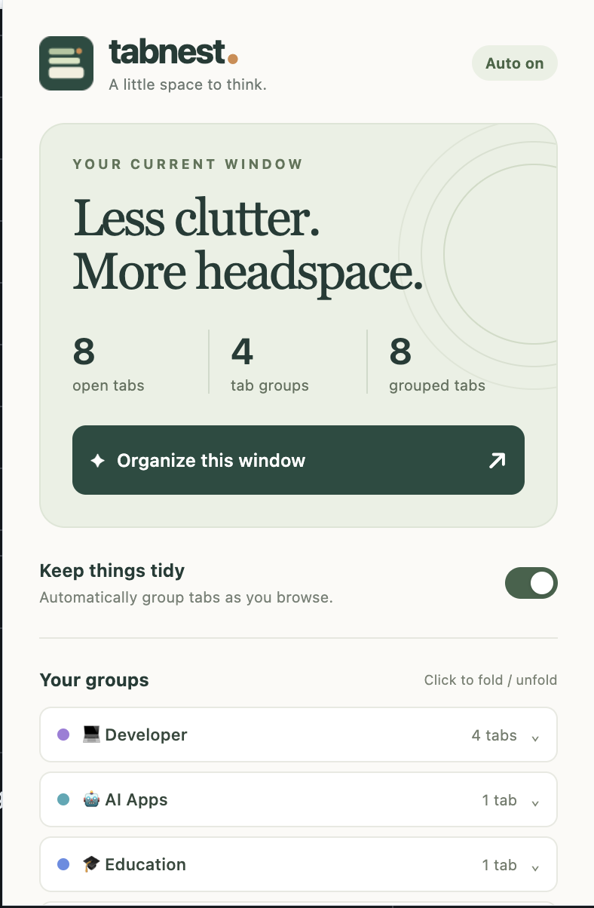

<div align="center">
  <h1> Tabnest</h1>
  <p><strong>A little space to think.</strong></p>
</div>

Tabnest is a small Chrome extension that automatically puts related tabs into color-coded tab groups. It runs entirely on your device, with no account, subscription, API key, analytics, or runtime dependencies.

<p align="center">
  
</p>

## Get the source

```sh
git clone https://github.com/jeremyrajan/tabnest.git
```

## Install in Chrome

1. Keep this `tabnest` folder somewhere permanent. If you downloaded the ZIP, extract it first.
2. Open `chrome://extensions` in Chrome.
3. Turn on **Developer mode** in the top-right corner.
4. Click **Load unpacked** and select the `tabnest` folder containing `manifest.json`.
5. Open Chrome's puzzle-piece menu and pin **Tabnest** to your toolbar.

Automatic grouping starts on installation. Click the Tabnest icon to organize immediately or change preferences. Requires Chrome 120 or newer. This is an unpacked extension, not a Chrome Web Store listing.

## How it works

- **Categories** (default): Tabnest ships with 22 editable starting categories including 💻 Developer, 🤖 AI Apps, 🎬 Media, 🗂️ Work, 🎓 Education, 🎨 Design, 💰 Finance, 📞 Communication, 🔎 Research & Learning, Shopping, Social, News, Travel, and more. It only creates categories needed by the tabs currently open. Every category emoji is editable.
- **Matching order**: your remembered website corrections take priority, followed by category website lists, then category keywords found in the tab title, URL path, and the page’s declared description metadata. Query strings and visible page content are not read. When two categories tie, Tabnest leaves the result unclassified instead of guessing.
- **Your taxonomy**: open **Manage categories & matching rules** from the popup to add, rename, recolor, or remove categories and edit their website and keyword rules. The limit is 60 categories, with 150 websites and 150 keywords per category.
- **Corrections**: use **Correct a website** in the popup to assign any open website to a category. Tabnest remembers up to 300 corrections and applies one to that domain and its subdomains. Corrections can be removed in Manage categories.
- **Browsing fallback**: an unrecognized site goes into Browsing by default. Turn this off to group unrecognized sites by exact hostname, where the website minimum of 2–5 tabs applies.
- Category groups can start with one tab, so a single GitHub tab becomes Developer and a single AI Studio tab becomes AI Apps.
- **Manual placement locks:** move a tab into another group or take it out of a group yourself and Tabnest leaves it exactly where you put it, even if its title or address later changes. The lock lasts for that tab's lifetime and is removed from session state when the tab closes.
- **Learns from manual moves:** when you move a website into a category group, future tabs from that hostname and its subdomains use the category automatically. Moving one into a custom group sends future matching tabs to that exact group while it exists. Move the website again to teach a new destination.
- **Exact-URL reuse** (on by default): when a newly opened tab finishes loading and an older tab in the same window has the identical normalized HTTP or HTTPS URL, Tabnest activates the older tab and closes the new duplicate. Query strings and fragments are significant. Existing tabs and cross-window matches are not closed.
- New tabs and completed navigations trigger grouping after about 1.5 seconds. Continuing tab activity does not reset that timer. A one-minute alarm provides a fallback if Chrome suspends the worker or tabs are temporarily busy. Chrome may delay background work when asleep or busy.
- Every regular window is organized independently. Tabs are never transferred between windows.
- Pinned tabs, incognito windows, Chrome internal pages, local files, and excluded websites are skipped.
- Existing groups are preserved. After a reload or restart, Tabnest recognizes a category group only when its exact name, color, and every member’s classification agree. It merges duplicate recognized category groups. Rename or recolor a group to take over its management.
- New background groups fold by default. A group containing the active tab stays expanded when created. Existing groups retain their fold state. Click a group in the popup to fold or unfold it.
- Grouping can reorder tabs so group members are adjacent. It never closes tabs, reloads pages, or reads page bodies.

## Controls

**Keep things tidy:** turns automatic grouping on or off across all regular windows. Pausing leaves groups in place.

**Organize this window:** organizes the current window immediately, including while automatic grouping is paused.

**Make it yours:** choose category or website grouping, folding behavior, fallback behavior, and excluded websites. Excluding `example.com` also excludes `sub.example.com`. Saving applies changes to managed tabs when automatic grouping is enabled. While paused, click Organize to apply them manually.

**Manage categories & matching rules:** edit the full local category catalog and remove remembered website corrections. Category changes are stored with your other local settings.

**Release automatic placements & pause:** removes automatically placed tabs from groups managed by this installation, across all windows, and pauses automatic grouping. All tabs remain open. Tabs placed by you stay where you put them; manually created, renamed, or recolored groups remain yours.

### Browser restarts

Settings persist across restarts. Group IDs are kept in Chrome's session storage, then safely reconstructed after a reload or restart from the group name, color, and classifications of all its tabs. Matching duplicate category groups are merged. A renamed, recolored, or mixed-content group is treated as your existing group and left intact.

## Privacy and permissions

Tabnest has no network requests or external scripts. A small local content script reads only a page’s declared description and site-name metadata; it does not inspect visible page content or modify the page. Metadata is capped, stored in Chrome’s in-memory session storage, and cleared when its tab closes or Chrome restarts. Your settings remain local. Nothing is sent to Tabnest or a third party.

| Permission | Purpose |
| --- | --- |
| `tabs` | Read tab URLs and group related tabs. Chrome's permission wording may refer to browsing history; the extension does not use the history API. |
| `tabGroups` | Set group names, colors, and collapsed state. |
| `storage` | Save preferences and session ownership. |
| `alarms` | Recover background organization after worker suspension. |
| Website access (`http://*/*`, `https://*/*`) | Read the declared description and site-name metadata used for local classification. Chrome may describe this broadly because the permission covers websites you visit. |

## Develop and verify

No build step or package installation is required. Edit the source, then click Reload on Tabnest's card at `chrome://extensions`.

Run the dependency-free tests with Node.js 20 or newer:

```sh
node --test tests/*.test.js
```

`tests/browser-smoke.mjs` additionally tests the actual extension in an isolated browser profile using Playwright and Chrome for Testing. It verifies event-driven automatic grouping, pinned tabs, sticky manual tab placement, the popup, exclusions, pause, and manual-group preservation. All test website requests are fulfilled locally. Install Playwright separately or set `PLAYWRIGHT_MODULE` to its `index.mjs`; optionally set `CHROMIUM_EXECUTABLE` to a compatible Chrome for Testing executable. Run:

```sh
node tests/browser-smoke.mjs
```

The browser test writes `tabnest-preview.png` next to the extension folder and creates a disposable profile under the OS temporary directory. It does not use your personal Chrome profile.

## Chrome API references

- [Tabs API](https://developer.chrome.com/docs/extensions/reference/api/tabs)
- [Tab Groups API](https://developer.chrome.com/docs/extensions/reference/api/tabGroups)
- [Storage API and session lifetime](https://developer.chrome.com/docs/extensions/reference/api/storage)
- [Alarms API](https://developer.chrome.com/docs/extensions/reference/api/alarms)

## Contributing and license

Contributions are welcome. Read [CONTRIBUTING.md](CONTRIBUTING.md) for the local development and pull-request guidelines.

Tabnest is available under the [MIT License](LICENSE).
